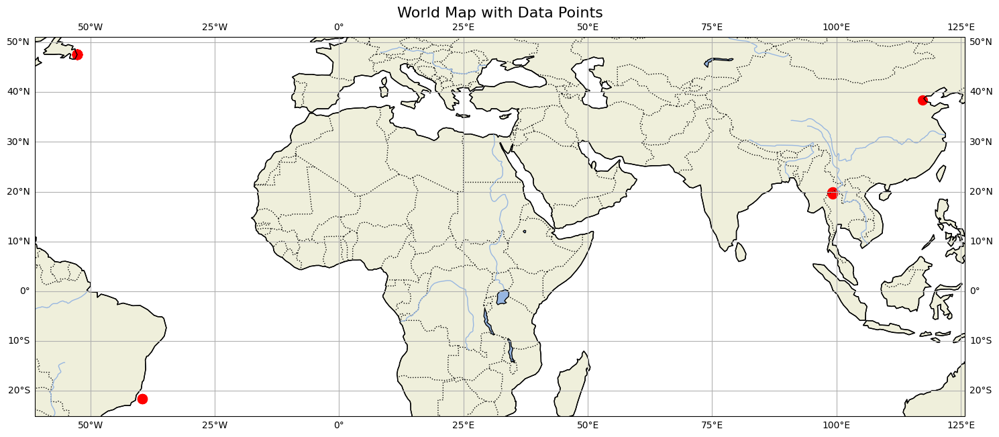

  

<h2 align="center">Community curated database of oil metagenomes</h2>

  

 

Community  curated database of the metagenome of oil and oil fields🛢️🦠

Show the interactive map 

+ [Description](#description)
+ [Usage](#usage)
+ [Samples Column Specifications](#samples-column-specifications)
+ [Libraries Column Specifications](#libraries-column-specifications)
+ [Contributing](#contributing)
  + [Some tips](#some-tips)
+ [Anknowlegments](#anknowlegments)

## Description 
This list contains information of oil connected metagenomes which include crude oil samples, samples from the different parts of oil production system in oil fields, also the samples from contaminated soil and water. This database is crucial for the use of metagenomic oil samples in machine learning. It follows the FAIR data organization principles. Here you can find the name of publications, years of publications, DOI, type of samples, geographic location of sample collection, and associated physical or chemical conditions.

The database will release bug fix updates on issues from the GitHub that have been reported every half a year. You can always create new issues and make a tag to become our contributor.

Our next update will include a web-based application for the user-friendly addition of new specimen information to the database.
<!-- START-MAP-INSERT -->

<!-- END-MAP-INSERT -->

## Usage 
To download the latest stable version of the OilMetagenomeDB example list and add data, follow these steps:
1. Go to the OilMetagenomeDB repository;
2. Copy the SSH key in the "<> Code" tab;
3. Use the command line to download the directory;
4. Go to the sample list of interest and complete the .tsv file in your spreadsheet program (for example, LibreOffice Calc, Microsoft Excel) or in the programming language of your choice (for example, R);
 
If you find dataset validation errors or think of a new dataset validation, please create an [issue](https://github.com/agni-bioinformatics-lab/OilMetagenomesDB/issues) in our GitHub repository. 

## Samples Column Specifications 

The SAMPLE tables stores information about the sample before it was sequenced: type, date of collection, geographic coordinates, depth, temperature of sample extraction, material of sample, etc.

Numeric and text fields must be filled in with "None" (capitalized) to indicate 'there can be no value meaningfully' or "unknownn" to indicate 'value is not known, but theoretically could be'. For example, if only water is being tested in a sample and there is no oil in the sample, the API index would be "None" because there is no oil in that sample and there can be no viscosity index. Conversely, if the viscosity index in the "crude oil" sample was not measured, then the API column should be set to "unknown".

All column with 'defined categories' should be validated against
`assets/enums/<column>.json`. This is necessary to ensure data consistency.

If you wish to a new category, please consult with the [agni-bioinformatics-lab](https://github.com/agni-bioinformatics-lab), and then add it to `assets/enums/<column>.json`.

Sample columns are as follows ([documentation](https://github.com/agni-bioinformatics-lab/OilMetagenomesDB/tree/main/assets/documentation/samples)):

## Libraries Column Specifications 
  The LIBRARIES tables store information about each specific reed from the library - id_ in databases, sequencing type (paired-end, single-end), sequencing strategy (WGS, RNA-Seq, amplicon), links to downloads and publications, etc.

Numeric and text fields must be filled in with "None" (capitalized) to indicate 'there can be no value meaningfully' or "unknownn" to indicate 'value is not known, but theoretically could be'. For example, if only water is being tested in a sample and there is no oil in the sample, the API index would be "None" because there is no oil in that sample and there can be no viscosity index. Conversely, if the viscosity index in the "crude oil" sample was not measured, then the API column should be set to "unknown".

All column with 'defined categories' should be validated against
`assets/enums/<column>.json`. This is to ensure data consistency. E.g., all
libraries sequenced on Illumina NextSeq 500s are listed as `NextSeq 500` (as
defined in `assets/enums/instrument_models.json`). This is to ensure data
consistency.

Library columns are as follows ([documentation](https://github.com/agni-bioinformatics-lab/OilMetagenomesDB/tree/main/assets/documentation/libraries)):

## Contributing 
Samples added to the OilMetagenomeDB should come from published studies. Samples should also be available in publicly accessible databases (e.g., EBI ENA or NCBI SRA).

When filling in the data, each sample from the publication will get a new row. For guidance on what information to add to each column see the README.md section "Usage" for a handy guide.

### Some tips 
* Do not add spaces at the end of data entries, for example the "geo_loc_name" column is checked against a predetermined list of countries, so if you type “China ” rather than just “China” they’ll be an issue as it won’t match.
* To check the columns that must match a predefined list, see enums
* If latitude and longitude are not specified, if the publication has only a very approximate location (such as a region), then click in the center of that region and record the latitude and longitude to 2 decimal places only.
  * If only a country with no additional information is specified as a sample location, enter the coordinates of the middle of that particular country, but without the decimal places.
* Be sure to record the correct archive_accession. Check out the README.md. These normally should be ‘SRA sample’ IDs (i.e. ERS or SRS for the ENA and NCBI SRA respectively), however please ask the coreteam if you are in doubt or have a different archive. Careful: You may have multiple ERS/SRS codes per sample as some people upload each library as a different ‘sample’. If this is the case be sure to include all the sample accessions comma separated list: ERRXXXX,ERRXXXXX,ERRXXXX. Always go with the sample accession rather than the run accession.

## Anknowlegments 
 We aimed to create a comprehensive database to serve as the foundation for our machine learning models, as no existing database provides such extensive insights into oil metagenomic patterns. And our team would like to express our gratitude to [AncientMetagenomeDir](http://www.spaam-community.org/AncientMetagenomeDir/) for inspiring us to create this public database. We would also like to thank ITMO University, AGNI and Tatneft for supporting the project.
